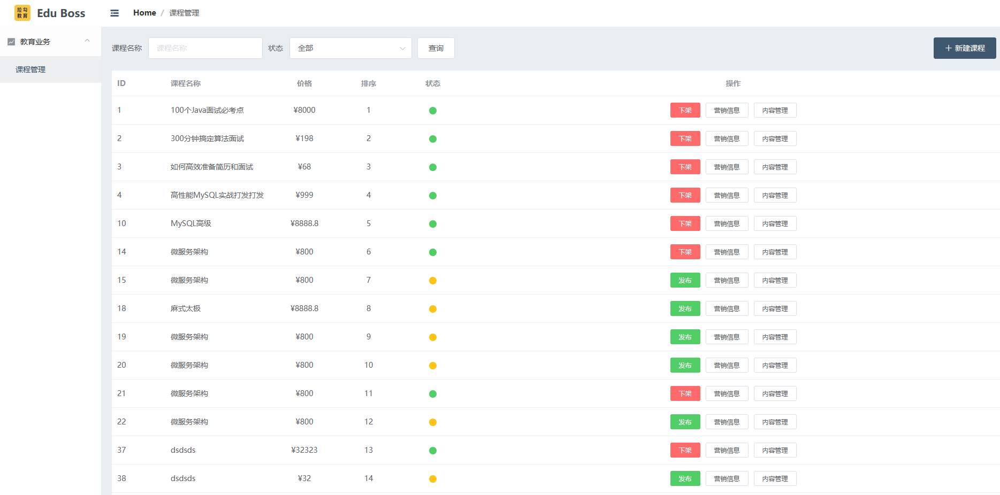

# JavaWeb单体架构项目：拉勾教育课程管理系统 后端

对应的项目前端地址：https://github.com/yumengmeng92/edu-boss



# 笔记
# idea部署web项目的两种方式

war模式：将项目以war包的形式上传到服务器webapps目录  
war exploded模式：仅仅映射目录，相当于在项目源文件夹中启动一样


# webapp部署

把webapps/upload添加到external source，jsp能直接引入路径
```html

```

# BeanUtils

## 1. 介绍
    BeanUtils主要用于优化JavaBean封装数据操作。可以将一个表单提交的所有数据封装到JavaBean中。
    
## 2. 常用方法

| 方法 | 描述 |
| --- | --- |
| | |

# POST请求常用四种数据提交格式

| 格式 | 描述 |
| --- | --- |
| Content-Type: application/x-www-form-urlencoded | 在发送前编码所有字符（默认）。 请求体中的数据会以表单形式（键值对）发送到后端 |
| Content-Type: application/json | 请求体值的数据会以json字符串的形式发送到后端 |
| Content-Type: multipart/form-data | 不对字符编码。在使用包含文件上传控件的表单时，必须使用该值。 |
| Content-Type: text/plain | 空格转换为 "+" 加号，但不对特殊字符编码。 |

* 注意：JSON和多部件上传无法通过个体Parameter获取  数据